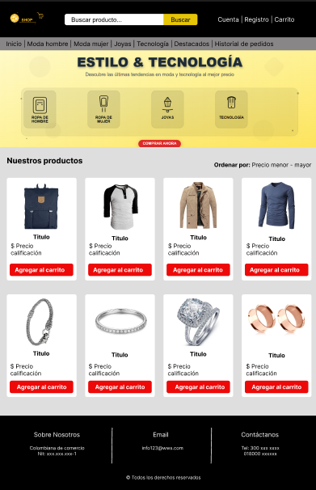
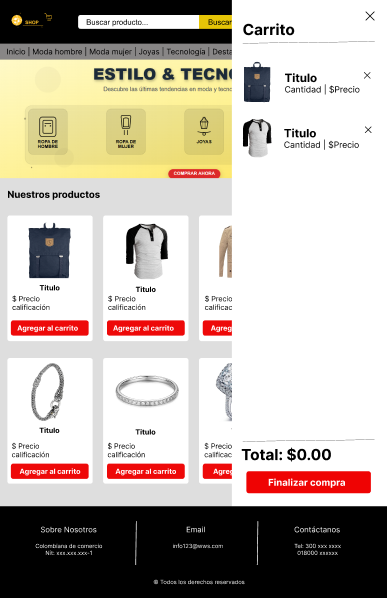
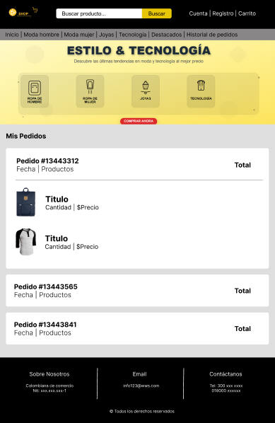

# World Wide Shop


## Visión General del Proyecto

World Wide Shop es un proyecto de comercio electrónico interactivo y responsivo, diseñado para ofrecer una experiencia de compra fluida y agradable. Este proyecto académico simula las funcionalidades esenciales de una tienda en línea, incluyendo la visualización de productos, un carrito de compras dinámico, autenticación de usuarios (login y registro), y un historial de pedidos.

El objetivo principal de este proyecto fue aplicar conocimientos de desarrollo frontend utilizando HTML, CSS (con Tailwind CSS) y JavaScript puro, enfocándose en la interactividad, la gestión del estado del usuario y el manejo de datos (a través de la API de Fake Store y `localStorage`).

Para visualizar el aplicativo web da click [aqui](https://bryanvillabona.github.io/world-wide-shop/)

## Características Principales

* **Carrusel de Productos Dinámico**: Un carrusel de imágenes en la página de inicio que rota automáticamente y permite navegación manual.
* **Listado de Productos Interactivo**:
    * Carga de productos desde una API externa (Fake Store API).
    * Filtrado de productos por categorías (electrónica, joyería, ropa de hombre/mujer).
    * Visualización de productos "destacados" (calificación de 4 estrellas o más).
    * Funcionalidad de búsqueda en tiempo real por título del producto.
    * Opciones de ordenamiento por precio (ascendente/descendente) y nombre (A-Z/Z-A).
* **Carrito de Compras Funcional**:
    * Agregar y eliminar productos del carrito.
    * Actualización en tiempo real del contador de artículos y el total del carrito.
    * Persistencia del carrito de compras utilizando `localStorage`.
    * Modal de confirmación de compra antes de finalizar.
* **Sistema de Autenticación de Usuario**:
    * Modal de login y registro.
    * Persistencia de la sesión del usuario utilizando `localStorage`.
    * Cambio dinámico del estado de "Cuenta" a "Cerrar sesión" cuando el usuario está autenticado.
* **Historial de Pedidos (Mis Pedidos)**:
    * Almacenamiento de pedidos realizados por usuario en `localStorage`.
    * Visualización detallada de cada pedido con un diseño de acordeón.
    * Funcionalidades para eliminar pedidos individuales o limpiar todo el historial.
    * Resumen estadístico de las compras del usuario.
* **Diseño Responsivo**: Adaptabilidad a diferentes tamaños de pantalla (móvil, tablet, escritorio) utilizando Tailwind CSS.
* **Experiencia de Usuario Mejorada**: Feedback visual al agregar productos al carrito, animaciones suaves y una interfaz de usuario intuitiva.

## Tecnologías Utilizadas

* **HTML5**: Estructura semántica del contenido.
* **CSS3**: Estilos y diseño.
    * **Tailwind CSS**: Framework CSS para un desarrollo rápido y un diseño responsivo.
* **JavaScript (ES6+)**: Lógica interactiva y manipulación del DOM.
* **Fake Store API**: Para obtener datos de productos de demostración.
* **`localStorage`**: Para persistir el estado del carrito, usuarios y pedidos.
* **Phosphor Icons**: Para los iconos de la interfaz de usuario.

## Maquetación y Diseño (Figma)

El diseño de la interfaz de usuario de World Wide Shop fue creado en Figma, siguiendo principios de diseño moderno y usabilidad. Aquí se muestran algunos de los wireframes y mockups clave que guiaron el desarrollo:

**Pantalla principal:**



**Carrito de compras:**



**Historial de pedidos:**



**Link de Figma**: [Ver diseño completo en Figma](https://www.figma.com/proto/q08CzzxRGp3ebidQS9mjQd/world-wide-shop?node-id=0-1&t=88xDhI0gt7JRqeHR-1)

## Cómo Ejecutar el Proyecto

Para ver World Wide Shop en tu máquina local, sigue estos pasos:

1.  **Clona el repositorio:**
    ```bash
    git clone https://github.com/BryanVillabona/world-wide-shop.git
    ```
2.  **Navega al directorio del proyecto:**
    ```bash
    cd world-wide-shop
    ```
3.  **Abre el archivo `Index.html`:**
    Simplemente abre el archivo `Index.html` en tu navegador web preferido (Google Chrome, Firefox, etc.). No se requiere un servidor local, ya que todo el contenido es estático y las peticiones a la API se manejan directamente desde el frontend.

## Estructura de Archivos

```
World-Wide-Shop/

├── index.html # Página de inicio de sesión
├── css/
│     └── estilos.css # Estilos personalizados
├── js/
│     └── main.js # Lógica principal de la aplicación
├── img/
│     ├── banner1.png # carrusel
│     ├── banner2.svg # carrusel
│	  ├── banner3.webp # carrusel
│	  ├── banner4.webp # carrusel
│     └── world-wide-logo.svg # Logo por defecto
│
└── README.md
```

## Contribuciones

Las contribuciones son bienvenidas. Para contribuir:

1. Fork del proyecto
2. Crea una rama para tu feature (`git checkout -b feature/AmazingFeature`)
3. Commit tus cambios (`git commit -m 'Add some AmazingFeature'`)
4. Push a la rama (`git push origin feature/AmazingFeature`)
5. Abre un Pull Request

## Autor

**Bryan Villabona**
- Diseñador y Desarrollador Frontend
- Proyecto académico/personal

## Agradecimientos

- [FakeStore](https://fakestoreapi.com/) por proporcionar la API gratuita
- [Tailwind CSS](https://tailwindcss.com/) por el framework de estilos